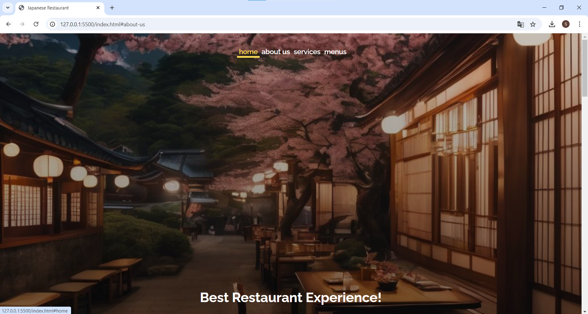
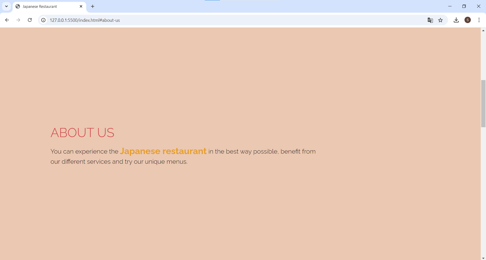
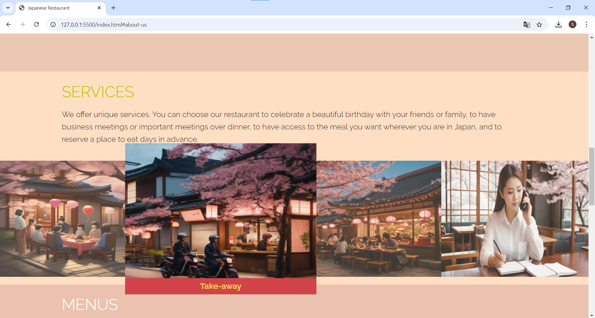
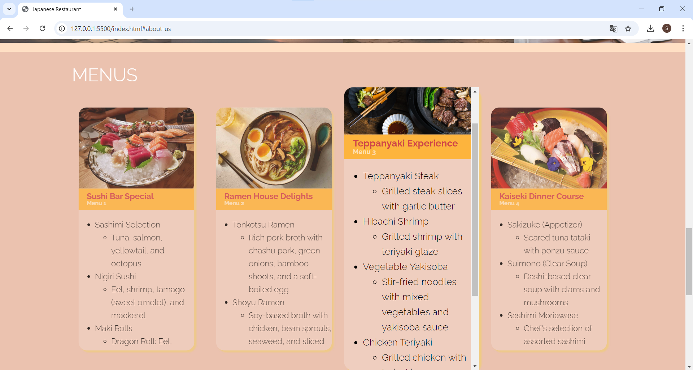
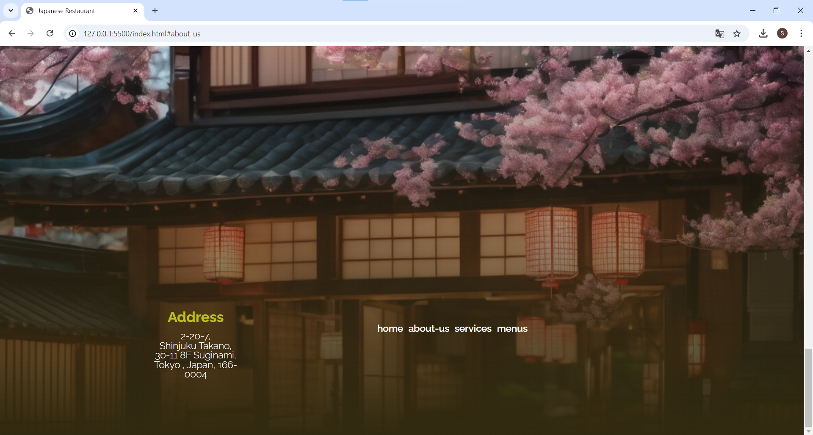

# Japanese Restaurant Webpage

A simple, clean, and responsive static webpage for a fictional Japanese restaurant.  
Built using only **HTML** and **CSS** — my first project during my internship.

---

## Features

- **Pure HTML & CSS** — No JavaScript or frameworks
- **CSS Animations** — Smooth transitions and hover effects
- **Responsive Design** — Mobile-friendly layout using media queries

---

## Webpage Sections

- **Header** – Restaurant name & navigation menu
- **Hero Section** – Large banner with call-to-action
- **About Us** – Description of the restaurant and its values
- **Menu** – Showcase of featured dishes with images and prices
- **Gallery** – Visual display of food and interior photos
- **Contact** – Address, map, contact form, and social links
- **Footer** – Copyright and external links


---

## Getting Started

You can view this project by simply opening the index.html file in your browser.

Clone and Run Locally
   ```bash
      git clone https://github.com/SKT1803/japanese-restaurant.git
         cd japanese-restaurant
  ```
Then, open index.html in any browser.


---

## Overview
<br>
<table>
  <tr>
     <td></td>
     <td></td>
  </tr>
  <tr>
      <td></td>
      <td></td>
  </tr>
  <tr>
    <td></td>
  </tr>
</table>  


